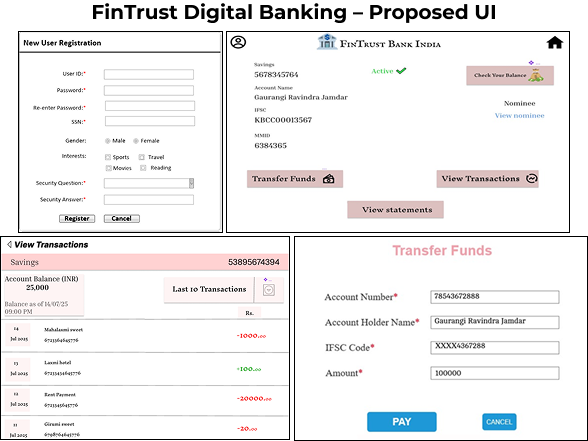

# FinTrust Digital Banking Project

## 📌 Project Overview
This repository contains the **complete business analysis documentation** for FinTrust Bank’s transition from branch-only operations to a **24x7 digital banking platform**.  
It demonstrates the **full BA project lifecycle** — from requirements gathering to solution design — including BRD, FRD, user stories, wireframes, and process flows.

---

## 🏦 Problem Statement
Currently, FinTrust Bank only serves customers in physical branches, requiring in-person visits for:
- New account registration
- Balance inquiries
- Fund transfers
- Transaction details requests

This leads to:
- High operational costs
- Long queues and poor customer experience
- Customers moving to digital-first banks

---

## 💡 Proposed Solution
Create a **customer-facing online banking platform** to:
- Provide 24x7 account access
- Enable profile, account, and fund management
- Integrate with the bank’s core banking and authentication systems
- Reduce in-branch workload and improve customer experience

---

## 📂 Repository Contents

| # | Folder/File | Description |
|---|-------------|-------------|
| 1 | [**Business Requirements Document (BRD)**](1_BRD/FinTrust_BRD.docx) | Project background, high-level requirements, and scope |
| 2 | [**Functional Requirements Document (FRD)**](2_FRD/FinTrust_FRD.docx) | Detailed system features, workflows, and embedded wireframes |
| 3 | [**User Stories**](3_User_Stories/) | Agile user stories with acceptance criteria for core banking features |
| 4 | [**Wireframes**](4_Wireframes/) | PNG images of the digital banking UI |
| 5 | [**Process Flows**](5_Process_Flows/) | As-Is and To-Be diagrams showing workflow changes

---

## 🛠 Tools & Techniques Used
- **Documentation:** Microsoft Word  
- **Wireframing:** Balsamiq / Figma / Axure RP  
- **Process Flows:** Lucidchart / Visio  
- **Analysis:** User Story Mapping, Use Case Modeling, Requirements Elicitation

---

## 📸 Wireframe Previews
Below are a few sample wireframes from the project:

.png)  
.png)  
.png)

---

## 📊 Process Flow Samples
  

---

## 🎯 Key Features in the Proposed System
- **Digital Profile Management** (Register, Login, Password Management)
- **Dashboard** (Quick profile, account summary, transactions)
- **Accounts Management** (Profile editing, statements download)
- **Funds Management** (Recipient management, transfers, payment history)

---

## 👩‍💼 About This Project
This is a portfolio project created as part of my **Business Analyst career journey**, demonstrating my capability to deliver **end-to-end project documentation** in a real-world banking scenario.

**Author:** Rishikesh Choudhary  

**LinkedIn:** [Rishikesh Choudhary](https://www.linkedin.com/in/rishikesh-choudhary-ba-166100377)  

**Email:** rishikeshchoudhary.ba@gmail.com
